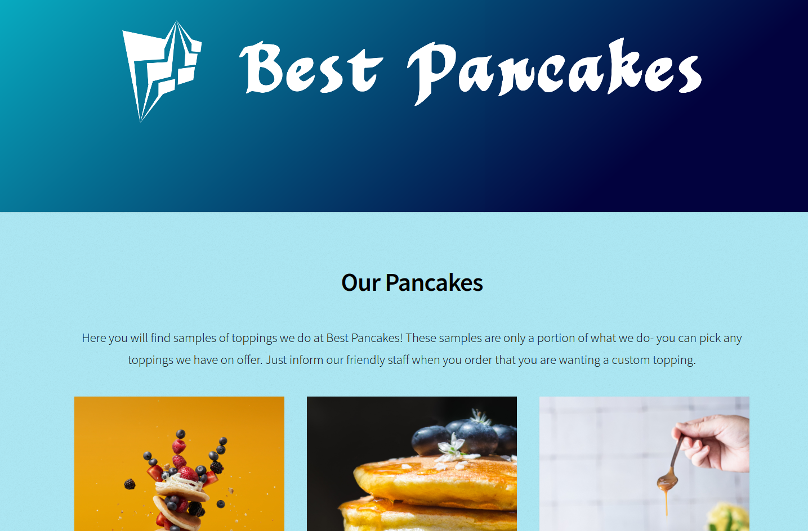

# Best Pancakes

### About Best Pancakes
A simple one page website, suitable for the small business.
You can have a look at it here [Best Pancakes](https://bestpancakes.netlify.app/)

### How It Is Done
Tech used: HTML5, CSS3 and JavaScript

This simple one page website has been created with the need of a small business in mind - as example a pancake shop which is serving to customers who come in and order.

Those customers may check in advance online what categories of pancakes are on offer.

So on creating this project, a plain approach was needed. The images can be linked to additional pages if needed, to show each and individual topping there is.

Also, the small business would like to tell the customer where they are situated. So in this project, the about section would do exactly that- informing of the location.

To round the this small project up, there is a contact form on the bottom, so the shop could be contacted

[^1]: Disclaimer: This is an example of the type of work I can do.

### Lessons Learned
Working on this project has been a lot of fun, however there were a few things I have learned:

- Page Loading Time: Due to the nature of the images in this project, the page loading time is quite slow. That can be optimized and I will do at some point in the future
- Keep Focus: During development, it had been quite easy to loose focus and making it overly complicated. This is a simple project and it needed to be just that